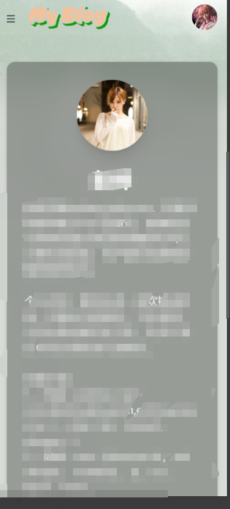

## 我的博客
[MyBlog：记录简单生活](https://blog.gwsee.com)

## Star
感谢你的星星
    
    已完成功能：
        博客，代办事项，随机名言警句，备忘录
        个人介绍，工作经历，项目经历
        旅行相册

## 关于技术
golang+vue3为主

    go主要是用的b站开源的kratos框架；
        采用了bff层和grpc通信的模式,分开了所有不同类型的应用.
      另外还涉及了mysql,ent,ali-oss

    vue3 使用的vite构建的 可以在web/pc目录下看到；大部分样式是使用v0帮我优化调整的 
      前期采用了部分的ant-design-vue的ui 后期使用的是 tailwindcss样式表

## 关于后续可能做的
```
    付费博客
    项目脑图
    临时身份
```
### PC预览

```
功能：代办事项，随机名言警句，博客查询，备忘录
```

```
功能：博客记录
```

``` 
功能：支持不同情况展示形式不一致
     记录各种照片
```

```
功能：按照一定规则展示的所有自己能够看到的照片
```

``` 
功能：个人简介,工作经历，项目经历等
```
### 移动端预览




